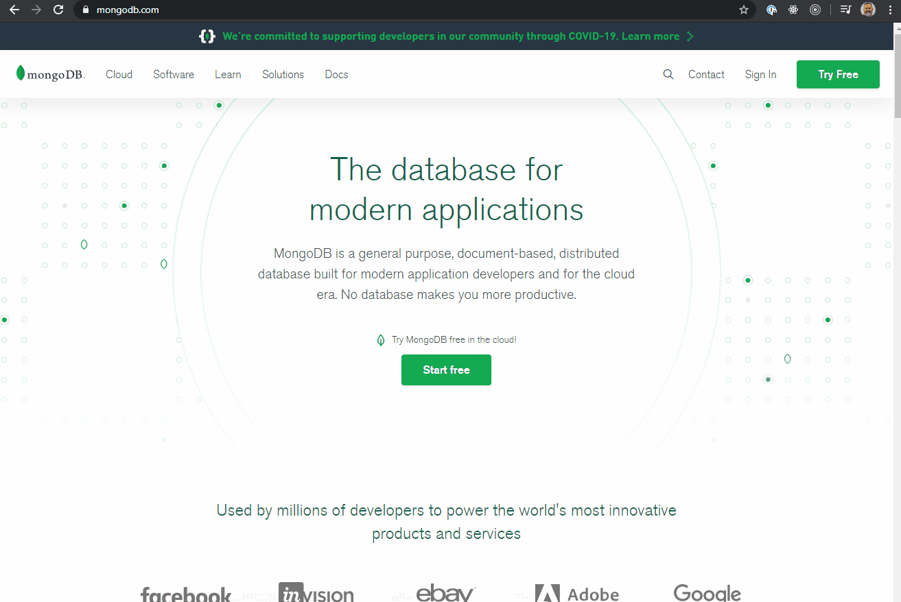

# Introduction to MongoDB

## Setup Mongo

Go to [mongodb.com](https://mongodb.com) and download the installer for your OS.



This will download the mongodb server that will allow us to run mongodb locally.

Select your OS to continue installation.

- [Mac](setup/mac.md)
- [Windows](setup/win.md)

## Start the Server

1. Open a new PowerShell
1. Type `mongod --dbpath <PATH_TO_DB>` to start the server

```bash
# Example WIN
mongod --dbpath "C:\Users\gnome\Documents\data\db"

# Example Mac
mongod --dbpath /Documents/data/db
```

You will need to edit it to match your own path.

**Windows TIP:** If you choose to setup the `data/db` folder at the root of your `C:` drive you don't have to enter the path with the command. You can simply type `mongod`.

Once you have the mongo server running, you need to keep this window open to keep the server up.

Open a new Terminal/PowerShell window to _use_ mongodb. In this window, type `mongo`. This will connect you to database server that you started in the previous step.

```bash
mongo
```

This is where you'll be able to run commands on the database.

Keep these two terminal windows open. We will connect to the running databases via Node and verify that our interactions are actually successful by querying the db from the second terminal. _Once we move entirely to Node to connect to the db, you can close this window. Only the `mongod` window needs to remain open._

## Start the Node server

```bash
yarn dev
```

**Now off to the exercises!!**
