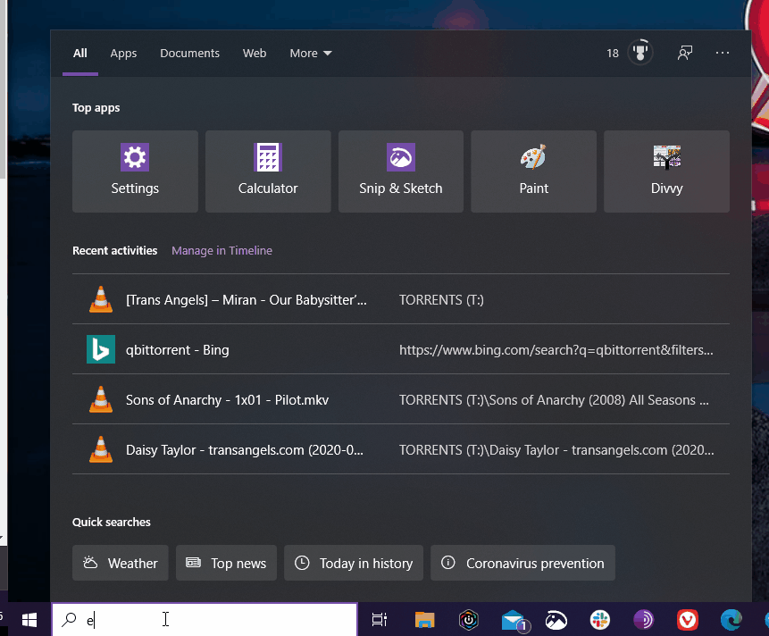
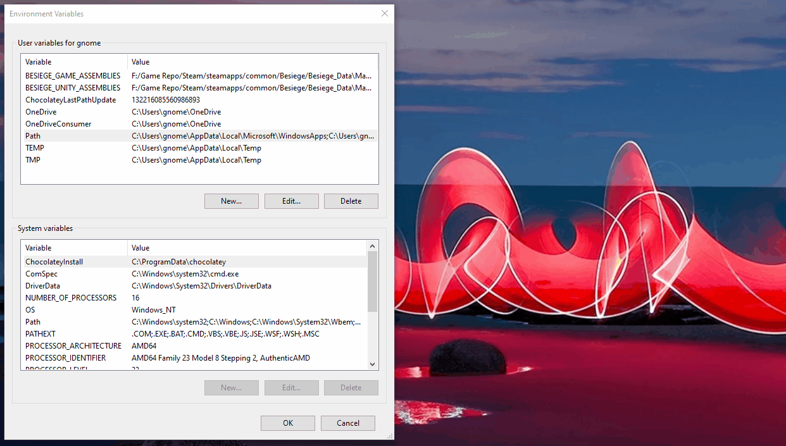
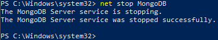

# Set up MongoDB on Windows

1. Run the installer that you downloaded from [mongodb.com](https://mongodb.com)
1. Create a `data` folder in your Documents folder.
1. Inside of the `data` folder create a `db` folder.

## Create a Path to your MongoDB application

1. To do this, you will need to **Edit environment variables for your account**. _See gif below_



1. Select the Path variable
1. Click 'Edit'
1. Click Browse and locate your MongoDB installation



## Stop the Service!

On Windows, MongoDB was installed as a service and is currently running. We want to stop it and start it ourselves. It will allow us to use our own `data/db` folder(s) instead of the basic service. _You will need to do this after a computer restart._

To stop the MongoDB service open an Administrator PowerShell instance and type

```bash
net stop MongoDB
```


